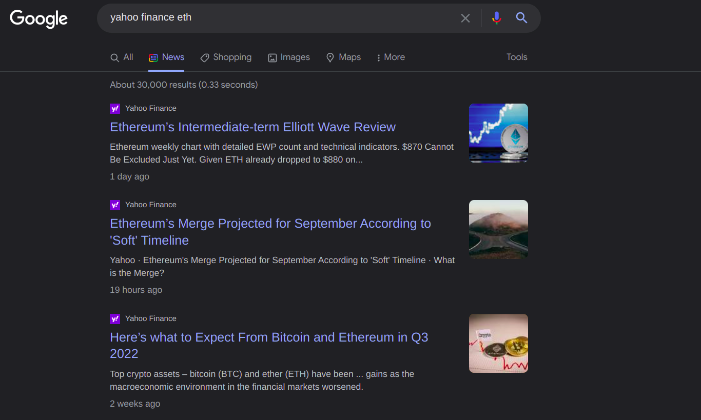
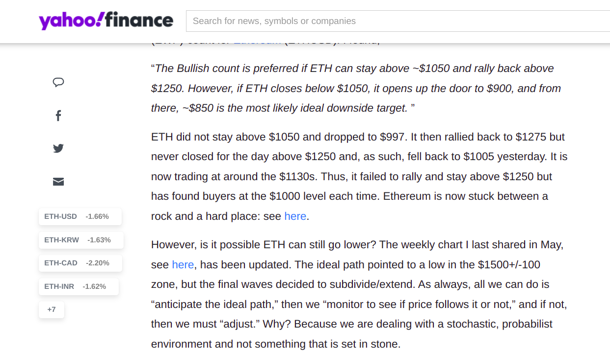
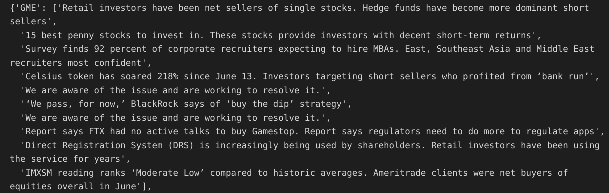

# Features:
## Sentiment Analysis of Custom Tickers
1. Change your required ticker in the `monitored_tickers` list in the `scrapesummarise.py` file.
2. Then the program would scrape Google News for news articles related to the ticker (eg: ETH.)
    <!--  -->
3. Then we go into each and every article from this page, and scrape the article from there.
    
4. The text from each article is summarised using the Pegasus model which was pretrained on Financial data. The model is used through the **HuggingFace Transformers** library <3.
    
5. Then on this summary, a sentiment score is calculated using HuggingFace Transformers Pipeline.
    ```py
        [{'label': 'NEGATIVE', 'score': 0.8954309225082397},
        {'label': 'POSITIVE', 'score': 0.9990646243095398},
        {'label': 'POSITIVE', 'score': 0.9955031275749207},
        {'label': 'POSITIVE', 'score': 0.9938773512840271},
        {'label': 'POSITIVE', 'score': 0.9979088306427002},
        {'label': 'NEGATIVE', 'score': 0.9879947304725647},
        {'label': 'POSITIVE', 'score': 0.9979088306427002},
        {'label': 'NEGATIVE', 'score': 0.9996492862701416},
        {'label': 'NEGATIVE', 'score': 0.9811649322509766},
        {'label': 'NEGATIVE', 'score': 0.9981441497802734}]
    ```
6. A CSV File is created with all the ticker data, summaries and the respective sentiment scores.
    ```
        Ticker,Summary,Label,Confidence,URL
        GME,Retail investors have been net sellers of single stocks. Hedge funds have become more dominant short sellers,NEGATIVE,0.8954309225082397,https://finance.yahoo.com/news/analysis-shorts-circle-gamestop-amc-050545286.html
        GME,15 best penny stocks to invest in. These stocks provide investors with decent short-term returns,POSITIVE,0.9990646243095398,https://finance.yahoo.com/news/15-best-penny-stocks-invest-142312669.html
      ```

## Reinforcement Learning:

Another aspect of this project is to try various Reinforcement Learning algorithms using OpenAI Gym and the Stable-Baselines library for doing trades automatically.